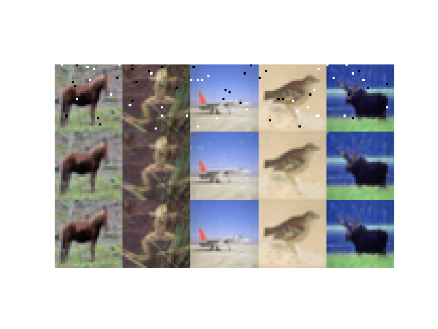
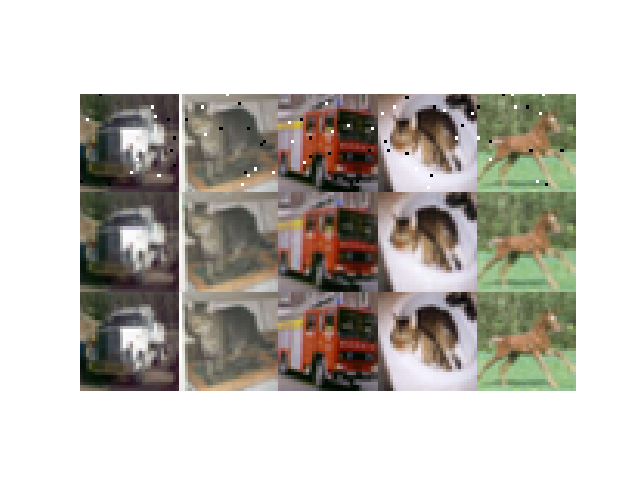
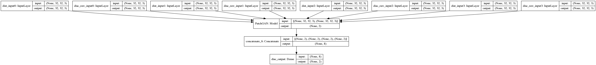

# Pix2Pix for Denoise
pix2pixを使ってノイズ除去を試みる

比較対象としてCAE(Convolutiona Auto Encoder)実装も行っている

# denoise result

### pix2pix_current_batch_traininig.png


### pix2pix_current_batch_validation.png


# code
以下コードの説明です

## AddNoise.py
画像にノイズを付与するスクリプト
```
usage: AddNoise.py [-h] --originpath ORIGINPATH --save2path SAVE2PATH

Add Noise script

optional arguments:
  -h, --help            show this help message and exit
  --originpath ORIGINPATH, -p ORIGINPATH
  --save2path SAVE2PATH, -s SAVE2PATH
```
## setup.py
データを訓練用と検証用に振り分けるスクリプト(9:1)
```
usage: setup.py [-h] --sourcedir SOURCEDIR --targetdir TARGETDIR --noisepath
                NOISEPATH --truthpath TRUTHPATH

setup image data

optional arguments:
  -h, --help            show this help message and exit
  --sourcedir SOURCEDIR, -s SOURCEDIR
  --targetdir TARGETDIR, -t TARGETDIR
  --noisepath NOISEPATH, -np NOISEPATH
  --truthpath TRUTHPATH, -tp TRUTHPATH
  
```
## load.py
画像を読み込むスクリプト
pix2pix.pyから呼び出し
## model.py
モデルを構築するスクリプト
pix2pix.pyから呼び出し
## pix2pix.py
pix2pix学習スクリプト
```
usage: pix2pix.py [-h] [--datasetpath DATASETPATH] --line_token LINE_TOKEN
                  [--imgsize IMGSIZE] [--epoch EPOCH] [--patchsize PATCHSIZE]
                  [--batchsize BATCHSIZE]

optional arguments:
  -h, --help            show this help message and exit
  --datasetpath DATASETPATH, -d DATASETPATH
  --line_token LINE_TOKEN, -l LINE_TOKEN
  --imgsize IMGSIZE, -s IMGSIZE
  --epoch EPOCH, -e EPOCH
  --patchsize PATCHSIZE, -p PATCHSIZE
  --batchsize BATCHSIZE, -b BATCHSIZE

```
## cae.py
CAE学習スクリプト
```
usage: cae.py [-h] [--datasetpath DATASETPATH] [--line_token LINE_TOKEN]
              [--imgsize IMGSIZE] [--epoch EPOCH] [--patchsize PATCHSIZE]
              [--batchsize BATCHSIZE]

Train Denoise Convolutional Auto Encoder

optional arguments:
  -h, --help            show this help message and exit
  --datasetpath DATASETPATH, -d DATASETPATH
  --line_token LINE_TOKEN, -l LINE_TOKEN
  --imgsize IMGSIZE, -s IMGSIZE
  --epoch EPOCH
  --patchsize PATCHSIZE
  --batchsize BATCHSIZE
```
## predict.py
学習済みのモデルを用いて実際にノイズ除去を行うスクリプト
```
usage: predict.py [-h] [--modeljson MODELJSON] [--modelweight MODELWEIGHT]
                  --imgpath IMGPATH --savepath SAVEPATH
                  [--loadimgsize LOADIMGSIZE]

denoise predict using pix2pix model

optional arguments:
  -h, --help            show this help message and exit
  --modeljson MODELJSON, -m MODELJSON
  --modelweight MODELWEIGHT, -w MODELWEIGHT
  --imgpath IMGPATH, -p IMGPATH
  --savepath SAVEPATH, -s SAVEPATH
  --loadimgsize LOADIMGSIZE, -l LOADIMGSIZE
```
# prepare the datasets
```
datasets/
├ noise_train (学習用:ノイズのある入力画像)
  ├ image1.png
  ├ image2.png
  └ image3.png
├ truth_train (学習用:ノイズのない出力画像)
    ├ image1.png
    └ image2.png
├ noise_val   (検証用:ノイズのある入力画像)
    ├ image1.png
    └ image2.png
├ truth_val   (検証用:ノイズのない出力画像)
    ├ image1.png
    └ image2.png
```

あとはload.pyで自動的にすべての画像を読み込んでくれる

# model

### Dsicriminator


### Generator


# Prerequistic

- Software
    - python3.6.3
    - tensorflow==1.7.0
    - keras==2.1.5
    - numpy==1.14.0
    - matplotlib==2.2.2
    - opencv-python==3.4.1.15
