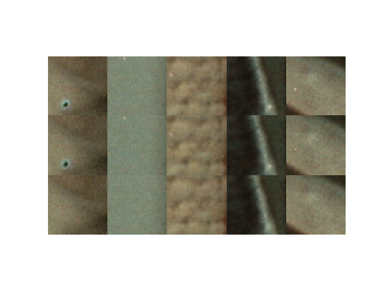
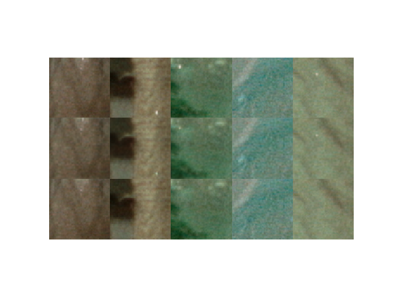

# Pix2Pix for Denoise
pix2pixを使ってノイズ除去を試みる

ひとまずCifar10でやってみる

# denoise result

## current_batch_traininig.png


## current_batch_validation.png


# prepare the datasets
```
datasets/
├ noise_train (学習用:ノイズのある入力画像)
  ├ image1.png
  ├ image2.png
  └ image3.png
├ truth_train (学習用:ノイズのない出力画像)
    ├ image1.png
    └ image2.png
├ noise_val   (検証用:ノイズのある入力画像)
    ├ image1.png
    └ image2.png
├ truth_val   (検証用:ノイズのない出力画像)
    ├ image1.png
    └ image2.png
```

あとはload.pyで自動的にすべての画像を読み込んでくれる

# code
以下コードの説明です

## AddNoise.py
画像にノイズを付与するスクリプト

## load.py
画像を読み込むスクリプト

## model.py
モデルを構築するスクリプト

## pix2pix.py
こいつで動く

# Usage


# Dependency
